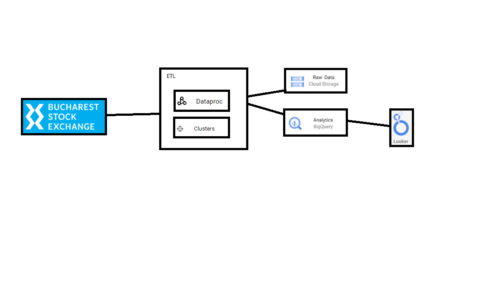
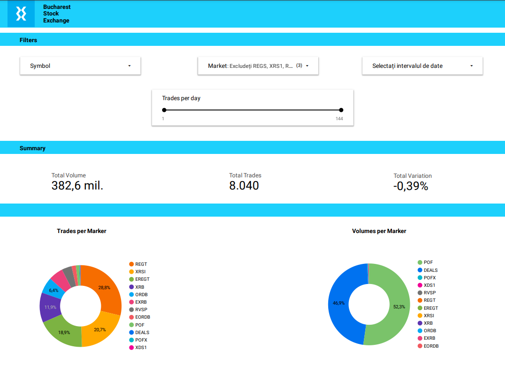

# BVB Data Procesing | Data Engineering GCP Project

## Introduction

This project aims to process and analyze historical trading data from the Bucharest Stock Exchange (BVB) using Apache Spark in a distributed environment. The workflow includes extracting historical trading data from a BVB API source, storing it in both the distributed Hadoop File System (HDFS) and Google Cloud Storage (GCP Storage). Subsequently, data modeling and cleaning are performed using PySpark, and the processed dataset is loaded into a BigQuery database for further analysis. This integrated approach leverages technologies such as Spark, Hadoop, GCP Storage, and BigQuery to achieve efficient and scalable processing of financial data.

## Architecture 

## Technology Used
- Programming Language - Python - Bash

Google Cloud Platform
1. Dataproc
2. Google Storage
3. BigQuery
4. Looker Studio

## Dataset Used
The Bucharest Stock Exchange (BVB) dataset contains historical information about market transactions. This information may include data such as symbols of financial instruments, names, market dates (open, close, low, high), traded volume, transaction value, and more. 

The used API exports data in the following format - https://github.com/IonitaA/Projects-and-Learning-Course-for-Data-Engineering/tree/main/Projects/BVB_Data_Processing/Sample_of_dataset/BVB_Historical_trading_info_20240126.csv

More info about dataset can be found here:
1. Website - https://bvb.ro/TradingAndStatistics/Trading/HistoricalTradingInfo

## Looker Dashboard

